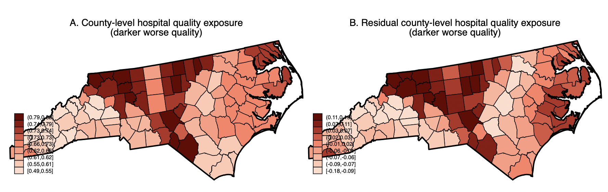

# IsHospitalQuality
 
- Current version: `1.0.0 22oct2022`
- Jump to: [`overview`](#overview) [`crosswalk`](#crosswalk) [`example`](#example) [`replication codes`](#replication-codes)  [`source files`](#source-files)  [`update history`](#update-history) [`authors`](#authors) [`references`](#references)

-----------

## Overview 

This repository contains replication files and data for [Kunz and Propper (2022)](https://www.sciencedirect.com/science/article/pii/S0094119022000493) more detail on the construction can be found in the paper. 

The analysis is based on several external datasets that we do not re-post here since held by different entities. Here we describe how to access them and provide our codes. We are encouraging any replication attempt and interested readers shall not hesitate to contact [Johannes Kunz](mailto:johannes.kunz@monash.edu) about any of these. For brevity, we exclude the multitude of replication files for the Appendix version but are happy to provide these upon request. 

We first explain the crosswalk and then present an example of how the crosswalk of HRR variates (hospital quality) and County-level outcomes (deaths from Covid-19) can be applied. 


## Crosswalk

In the paper, we explicitly describe the crosswalk to relate HRR-level variates to County-level outcomes. 

We assign to each county a weighted average of the quality exposure, which is equal to the fraction of zip codes that belong to the referral network. Weights are the number of zip codes in a county that merge into an HRR, divided by the total number of zip codes in the county, i.e.
$\frac{zip_{i_{HRR}}}{\sum_{i}zip_i}.$

We average across hospitals within a given HRR to derive quality at the HRR level and use these weights to calculate exposure at the county level. For example, Autauga County comprises 13 zip codes, 4 of which belong to HRR Birmingham and 9 to HRR Montgomery, with hospital quality averages of 0.34 and 0.28, respectively (where lower numbers reflect poorer quality). In this example, the assigned weighted quality exposure is 0.30. This places Autauga County in the 62.94th percentile of the county quality distribution, which has a mean of 0.38 and a standard deviation of 0.12. 

We refer to this approach as “zip-weighted”. 

The crosswalk contains other weighting methods, in our case, as robustness checks. First, we calculate quality exposure as the average of all HRRs a county has referral ties to without weighing by how many zip codes in a county belong to an HRR. We refer to this as an “equally-weighted” quality exposure. Second, the crosswalk file also contains an approach zip-code population-weighted weights (using census population estimates). 

Finally, [Dartmouth-DAC](https://github.com/Dartmouth-DAC/covid-19-hrr-mapping), provides a complementary crosswalk that is similar in many respects but results in more missing values. In our application, either crosswalk produces similar results, which is however not guaranteed. 


## Example

#### County-wide supply differences 

The figure shows the application of the weighting for North Carolina. 

NC has access to nine HRRs (Asheville, Charlotte, Durham, Greensboro, Greenville, Hickory, Raleigh, Wilmington, and Winston-Salem); thus each county might have ties to several hospital referral regions. In the left Figure, we show the raw weighting, and in the right conditional on county-level characteristics (residualized). 



#### Country wide quality differences 

Across the whole country, the quality looks like this: 


Of course, any other HRR-level characteristic can be disaggregated in the same manner. 

#### Some STATA example 

Here is the Stata script (see also example folder):

```stata
* change path 
cd "˜/Hospitalcompare/_raw/"

* 1. Load any type of HRR data, ie. Dartmouth provides a host of measures (in our application we use individual hospital quality aggregated to the HRR-level)
* Here for a simple example we just count the number of beds in HRR from AHA (see _sourcefiles for the source of data)
use Dartmouth_HOSPITALRESEARCHDATA/hosp16_atlas.dta
collapse (sum) AHAbeds , by(hrr)

* 2. Adjust format and merge with crosswalk 
tostring hrr, gen(hrrnum)
merge 1:m hrrnum using ˜/crosswalk/crosswalk_county_hrr.dta, nogen

* 3. Collapse on county-level for further analysis, using our preferred weights, others are provided
collapse (mean) AHAbeds [aw=zip_count_weight_in_HRR] , by(countyfips)
```

## Replication do-files 

Here we collect all dofiles used in our analysis. We do not repost the dataset as these were too large for the Github repository, please contact us if you have issues replication it. 

## Source files  

We do not re-post the publicly available datasets from the various sources here since they belong to different entities, however, we present all sources and do-files extracting and preparing the data. 

If you are interested in the exact datasets (in case there are updates or they are not available anymore, please contact us directly). 

The source file folder contains an overview of the files we used. 

## Update History
* **October 22, 2022**
  - initial commit
  

## Authors:

[Johannes S. Kunz](https://sites.google.com/site/johannesskunz/)
<br>Monash University 

[Carol Propper](https://www.imperial.ac.uk/people/c.propper)
<br>Imperial College London and Monash University 

## References: 

Kunz, J. S., K. E. Staub, & R. Winkelmann. 2021. [Predicting Individual Effects in Fixed Effects Panel Probit Models](http://doi.org/10.1111/rssa.12722). Journal of the Royal Statistical Society: Series A. 184(3): 1109-1145.

Kunz, J. S., C. Propper, K. E. Staub, & R. Winkelmann. 2021. [Assessing the Quality of Public Services: Does Hospital Competition Crowd-out the For-profit Quality Gap? ](https://drive.google.com/file/d/1bY_LMfkLYLaTaCQ4UF1-rYwAAOFA-Mpr/view). Working Paper

Kunz, J. .S & C. Propper. 2022. [JUE Insight: Is Hospital Quality Predictive of Pandemic Deaths? Evidence from US Counties](https://www.sciencedirect.com/science/article/pii/S0094119022000493). Journal of Urban Economics. Forthcoming 


